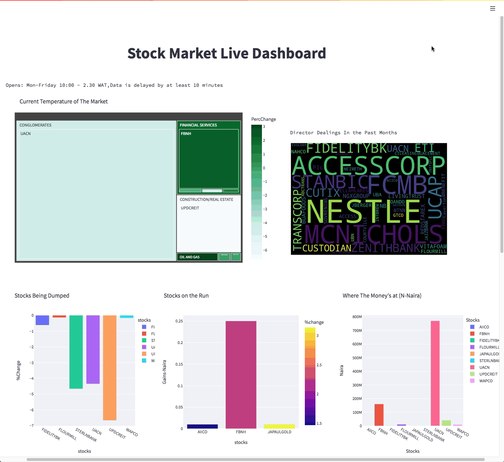

## NGX Dashboad

It has been said that humans are suckers for visuals.  Visualizations and dashboards 
have  become the goto-way means of displaying complex information succintly and compactly!
#NGX Dashboad# displays the entire NGX Market in near-real-time and more.

## How to Use:

1. create a virtual environment `virtualenv ~/.venv`
2. clone the repo ` git clone ngx-dashboards.gt`
3. run `make all`