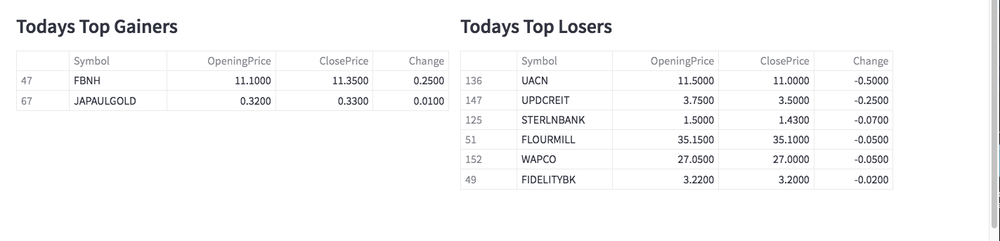

## NGX Dashboard

It has been said that humans are visual animals.Little wonder visualizations and dashboards 
have taken the data analytics world by storm. Through visualizations,
complex information are succintly and compactly presented!
*NGX Dashboard* displays the entire NGX Market in near-real-time and more.

## How to Use:

1. create a new folder and a virtual environment `virtualenv ~/.venv` or `python3.10 -m venv env`
2. activate the virtual environment e.g `source env/bin/activate`
3. clone the repo `git clone https://github.com/ajakaiye33/ngx-dashboard.git`
4. `cd` into `ngx_dashboard`
5. run `make install`
6. run `streamlit run stock_viz.py --server.port 8501`
7. Go over to your browser and point accordingly

Find it useful? .. give it a **star**! :wink: